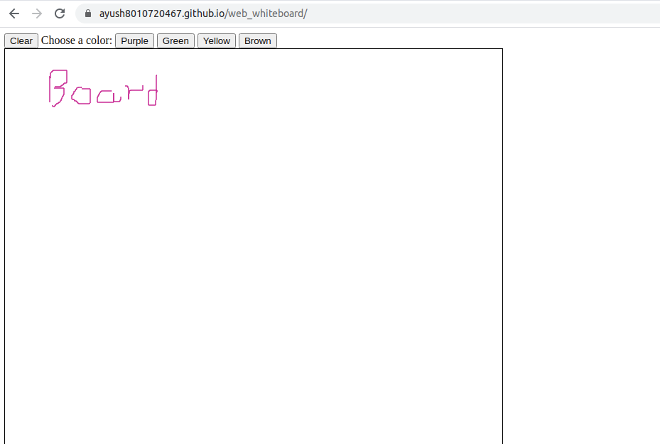

# Web Whiteboard 
Web Whiteboard is a project build with the similar functionality of whiteboard. It enables users to access various features like writing, clearing the entire whiteboard, and changing colors. 

## Contributing
Pull requests are welcome. For major changes, please open an issue first to discuss what you would like to change.

## License
[MIT](https://choosealicense.com/licenses/mit/)
